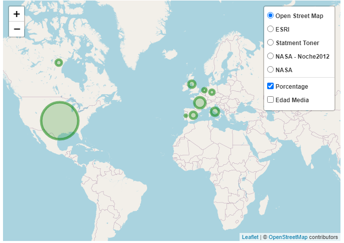
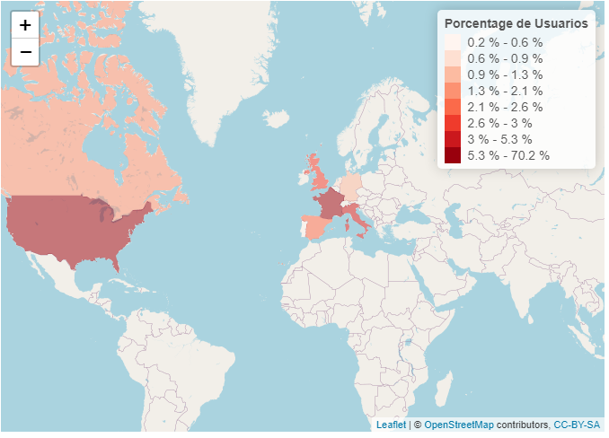
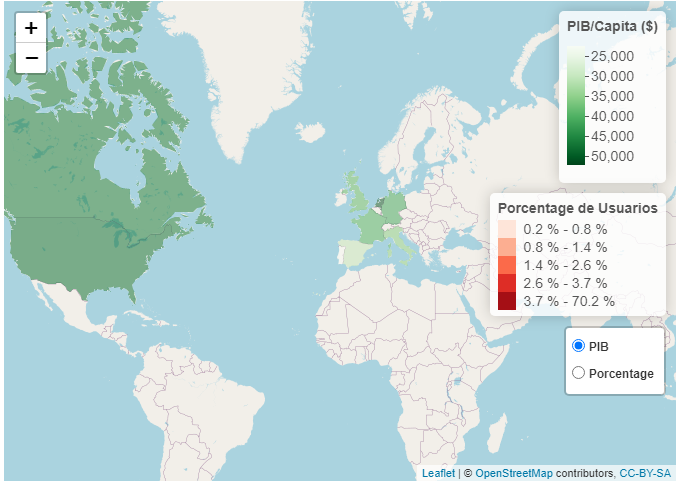

# Máster en Big Data y Analítica de Negocio

## IFFE TECH SCHOOL: BIG DATA MANAGEMENT

## Título: TRABAJO PRÁCTICO DEL MÓDULO DE DATA BASE MANAGEMENT

## Tabla de contenidos

<li><a href="#objetivo">Objetivo</a></li>
<li><a href="#file_descriptions">Descripción de los ficheros</a></li>
<li><a href="#questions">Questiones</a></li>
<ul>
    <li><a href="#q1">1.- ¿Qué información contienen estos archivos?</a></li>
    <li><a href="#q2">2.- Propón un modelo físico en estrella / copo de nieve para almacenar todos los datos adjuntos.</a></li>
    <li><a href="#q3">3.- Resuelve en SQL: Obtén el primer país de destino de cada usuario y con este dato calcula el porcentaje de usuarios que eligen cada uno de los paises por primera vez.</a></li>
    <li><a href="#q4">4.- Haz lo mismo en R usando la librería DPLYR.</a></li>
    <li><a href="#q5">5.- Crea un mapa interactivo con R, con un marcador de posición basado en la información adjunta por país (latitud y longitud) en el que se muestre el ratio calculado.</a></li>
    <li><a href="#q6">6.- Incluye el PIB de cada país en la etiqueta del punto 5. Observad que no se os proporciona este dato.</a></li>
</ul>

## Objetivo

Este trabajo se ha realizado como prueba evaluable correspondiente al módulo de Data Base Management del Máster de Big Data y Analitica de Negocio impartido por IFFE Business School en A Coruña.

Se nos propone analizar un par de datasets con información de clientes de Airbnb y resolver una serie de cuestiones que enumeraremos a continuación.

## Descripción de los ficheros

* **EER_Diagram_Model.mwb**: Fichero MySQL Workbench con el diagrama EER de la base de datos utilizada para el almacenamiento del dataset.
* **create_airbnb_database.sql**: Secuancia de comandos SQL generada con MySQL Workbench para la definición de la base de datos.

* **funcionesmysql.r**: Script en R con funciones auxiliares de lectura y escritura de tablas en MySQL.

* **consultas.sql**: Sentencias SQL utilizadas en el proyecto.

* **login_credentials.R**: Datos de conexión a la base de datos MySQL.

* **./data/covid_19_data.csv**: Fichero de datos descargado de Kaggle.

* **./data/countries.csv.zip**: Fichero proporcionado para el análisis con información de países visitados.

* **./data/gdppercapita_us_inflation_adjusted.csv**: Fichero obtenido de la página `gapminder` con información del PIB per cápita de cada país.

* **./data/ctrain_users_2.csv.zip**: Fichero proporcionado para el análisis con información sobre reservas de usuarios.

* **./pictures/**: Imágenes utilizadas en la documentación.

* **analisis_airbnb.Rmd**: Notebook de R Studio con la solución aportada.

* **analisis_airbnb.html**: Versión HTML del notebook anterior.

## Questiones:

Este ejercicio se planteó como una serie de questiones que el alumno debía abordar, por lo tanto vamos a enumerar en este documento dichas questiones haciendo un resúmen del planteamiento utilizado en la solución.

### 1.- ¿Qué información contienen estos archivos?

En este trabajo se nos proporcionan dos ficheros: `countries.csv.zip` y `train_users_2.csv.zip` que hemos cargado en los dataframes `df_countries` y `df_train_users`.

* **df_countries:**  En este caso tenemos una lista de 10 paises de destino, con algunos datos sobre ese país: lengua, coordenadas geográficas, km cuadrdos, etc. Parece que el país que se toma como referencia para calcular la distancia es Estados Unidos. También parece que se incluye una columna con el grado de afinidad entre las lenguas de origen y destino language_levenshtein_distance.

* **df_train_users:** Tenemos un dataframe con 16 columnas y 213451 filas con información sobre los usuarios y sobre la actividades que han realizado en el portal Airbnb. Adjunto a continuación la descripción de cada columna que nos proporcionan en la página de Kaggle:

    * **id**: user id
    * **date_account_created**: the date of account creation
    * **timestamp_first_active**: timestamp of the first activity, note that it can be earlier than date_account_created or * date_first_booking because a user can search before signing up
    * **date_first_booking**: date of first booking
    * **gender**
    * **age**
    * **signup_method**
    * **signup_flow**: the page a user came to signup up from
    * **language**: international language preference
    * **affiliate_channel**: what kind of paid marketing
    * **affiliate_provider**: where the marketing is e.g. google, craigslist, other
    * **first_affiliate_tracked**: whats the first marketing the user interacted with before the signing up
    * **signup_app**
    * **first_device_type**
    * **first_browser**
    * **country_destination**: this is the target variable you are to predict
    
Además hemos realizado un análisis más pormenorizado de los valores contenidos en cada uno de los datasets: valores nulos, tipos de datos, etc. Podemos consultar el notebook del trabajo para ver los detalles.

### 2.- Propón un modelo físico en estrella / copo de nieve para almacenar todos los datos adjuntos.

En este caso nos hemos decidido por un modelo en estrella como se indca en la figura de abajo.

Hemos decidido tratar cada atributo como una dimensión independiente y en general se ha recogido cada columna en una tabla diferente que será referenciada por un índice en la tabla de hechos.

Hemos hecho una excepción con los datos que recogen las características de cada usuario: edad, género, lengua, etc, que se han recogido en la tabla df_user. Y también hemos generado otra tabla para recogre las características del país de destino, df_pais.

los valores únicos de date_account_created y date_first_booking los hemos recogido en la tabla dim_date. Lo mismo ocurre con los idiomas referenciados en los dataframes de paises y usuarios que se han recogido en la tabla dim_language.

El campo timestamp_first_active se ha dejado sin tratar en la tabla fact_user_data. Se podría incluir como una dimensión más, contemplando la fecha, la hora, los minutos y los segundos, pero he preferido simplificar el diseño y dejarla como si fuese un registro o una medida de la tabla. Tendría sentido incluirlo en una dimensión si quisiésemos hacer consultas o agrupaciones por horas, pero en este ejercicio no es el objetivo. En este modelo podríamos definir perfectamente una tabla de hechos que solo contuviese dimensiones, ya que cada registro contiene información de un usuario determinado y no realiza ningún conteo o registro de eventos que puedan ser guardados.

El resultado se puede ver en esta imagen y se adjunta el diagrama EER en la documentación del proyecto:

Finalmente hemos introducido los datos de los ficheros en la estructura de la base de datos utilizando la librería `data.table`. Podemos también consultar el notebook para ver los detalles.

### 3.- Resuelve en SQL: Obtén el primer país de destino de cada usuario y con este dato calcula el porcentaje de usuarios que eligen cada uno de los paises por primera vez.

Para sealizar esta consulta hemos utilizado la sentencia SQL recogida en el fichero `consultas.sql`. Para ejecutarla henos usando la función `sendmysqlquery` del script `funcionesmysql.r`.

### 4.- Haz lo mismo en R usando la librería DPLYR.

Para realizar esta parte hemos preferido leer de la base de datos que hemos creado en lugar de usar los dataframes `df_train_users` y `df_countries` iniciales para utilizar funciones de consulta de bases de datos MySQL.

Para ello hemos cargado el contenido de las tablas Primero leemos las tablas `fact_user_data`, `dim_country` y `dim_date` en tres dataframes y hemos realizad un join sobre un único dataframe denominado `df_MySQL `.

Finalmente aplicando `deplyr` hemos realizado las mismas operaciones que en la sentencia sql que vimos antes.

### 5.- Crea un mapa interactivo con R, con un marcador de posición basado en la información adjunta por país (latitud y longitud) en el que se muestre el ratio calculado.

Para esta parte hemos realizado varias representaciones usando la librería `leaflet`. En la primera de ellas hemos decidio representar con marcadores cirulares de distinto tamaño tanto el porcentaje de cada país y la edad media de los visitantes.  La edad oscila entre los 43 años de Australia y los 56 de Alemania, lo cual hace que si hacemos el área de los círculos proporcional a la edad obtengamos tamaños muy similares. Para que la diferencia sea un poco más evidente hemos decidido cambiar esta relación. En este caso nos interesa destacar aquellos países que reciben visitantes más jóvenes de los que reciben visitantes mayores, aunque perdamos fidelidad a los datos.

El resultado final es algo similar a lo que podemos ver en este gráfico:

Otra forma de hacerlo es representar los paises con distintos colores en función del porcentage. Hemos añadido una leyenda con información que relacione el color con el valor. El porcentage de Estados Unidos es muy elevado comparado con los demás. Para favorecer una mayor variación cromática y se diferencien mejor los paises hemos definido la paleta de colores dividiendo los porcentajes en cinco quantiles. De otro modo sólo se vería oscuro Estados Unidos y no se distinguirían el resto de paises.

Este ha sido el resultado obtenido:

### 6.- Incluye el PIB de cada país en la etiqueta del punto 5. Observad que no se os proporciona este dato.

La información de PIB de cada país podemos descargarla de la página de [gapminder](https://www.gapminder.org/data/). En esta página podemos descargar una gran cantidad de información de muchos paises relativa a su economía, educación, sanidad, índices de desarrollo, población, etc.

Hemos preferido descargar el fichero de PIB per cápita ya que creo que refleja un poco mejor la riqueza del país que el PIB total.

La descripción que gapminder nos proporciona de los datos es la siguiente:

>GDP per capita is gross domestic product divided by midyear population. GDP is the sum of gross 
value added by all resident producers in the economy plus any product taxes and minus any 
subsidies not included in the value of the products. It is calculated without making deductions 
for depreciation of fabricated assets or for depletion and degradation of natural resources. 
Data are in constant 2010 U.S. dollars.

Siguiendo procedimientos similares a los utilizados en el punto anterior hemos diseñado un mapa en el que podemos observar el porcentage de visitantes de cada uno de los países y su PIB per cápita:

