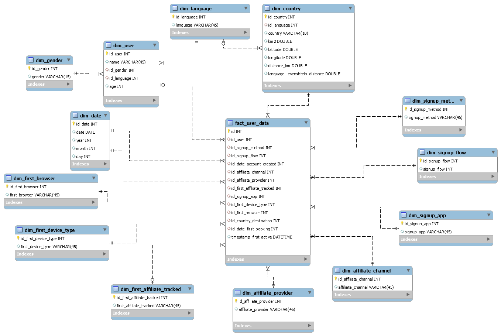

## Objectivo

Este trabajo se ha realizado como prueba evaluable correspondiente al módulo de Data Base Management del Máster de Big Data y Analitica de Negocio impartido por IFFE Business School en A Coruña.


## Librerías y Scripts

```{r}
library(data.table)
library(bit64)
library(dplyr)
library(ggplot2)
library(leaflet)
library(htmltools)
library(rgdal)
library(tidyr)
source('funcionesmysql.r')
```

Definimos un tema base para ser usado en las visualizacioens.

```{r}
tema_base <- function(){
                theme_minimal()+
                theme(
                   axis.title.x = element_text(size = 12),
                   axis.title.y = element_text(size = 12),
                   title = element_text(size = 12),
                   plot.title = element_text(hjust = 0.5)
                )+
                theme(
                   panel.grid.major = element_blank(), 
                   panel.grid.minor = element_blank(),
                   panel.background = element_blank(), 
                   axis.line = element_line(colour = "black"),
                   legend.justification = c(0, 1),
                   legend.position = "bottom",
                   legend.direction = "horizontal"
                )
              }
```

## Carga de datos

```{r}
# ficheros de entrada con los datos
countries_zip <- './data/countries.csv.zip'
train_users_zip <- './data/train_users_2.csv.zip'

# descomprimimos los ficheros
unzip(countries_zip)
unzip(train_users_zip)

# cargamos los datos de los ficheros csv
df_countries <- fread(file = 'countries.csv')
df_train_users <- fread(file = 'train_users_2.csv')

# borramos los ficheros csv descomprimidos
file.remove('countries.csv')
file.remove('train_users_2.csv')
```

## Questiones:

### 1.- ¿Qué información contienen estos archivos?

* Primero vamos a echar un vistazo a los datos que contienen cada uno de los dataframes que hemos creado.
Comenzaremos por `df_countries`:

```{r}
df_countries
```


En este caso tenemos una lista de 10 paises de destino, con algunos datos sobre ese país: lengua, coordenadas geográficas, km cuadrdos, etc. Parece que el país que se toma como referencia para calcular la distancia es Estados Unidos. También parece que se incluye una columna con el grado de afinidad entre las lenguas de origen y destino `language_levenshtein_distance`.


Dentro de df_train_users podemos ver:

```{r}
head(df_train_users, 10)
```


```{r}
dim(df_train_users)
```

Tenemos un dataframe con 16 columnas y 213451 filas con información sobre los usuarios y sobre la actividades que han realizado en el portal Airbnb. Adjunto a continuación la descripción de cada columna que nos proporcionan en la página de Kaggle:

* **id**: user id
* **date_account_created**: the date of account creation
* **timestamp_first_active**: timestamp of the first activity, note that it can be earlier than date_account_created or * date_first_booking because a user can search before signing up
* **date_first_booking**: date of first booking
* **gender**
* **age**
* **signup_method**
* **signup_flow**: the page a user came to signup up from
* **language**: international language preference
* **affiliate_channel**: what kind of paid marketing
* **affiliate_provider**: where the marketing is e.g. google, craigslist, other
* **first_affiliate_tracked**: whats the first marketing the user interacted with before the signing up
* **signup_app**
* **first_device_type**
* **first_browser**
* **country_destination**: this is the target variable you are to predict


Podemos echar un vistazo un poco más en profundidad a los datos que continen los datasets. 

* Por ejemplo podemos ver cuántos valores faltan en cada dataframe:

```{r}
na_count <- sapply(df_countries, function(x) sum(length(which(is.na(x)))))
data.frame(na_count)
```

En este caso era obvio que no había valores nulos porque ya habíamos printado el dataframe entero, solo tiene diez tuplas.

```{r}
na_count <- sapply(df_train_users, function(x) sum(length(which(is.na(x)))))
data.frame(na_count)
```

En el dataframe de información sobre los usuarios vemos que sólo aparecen valores nulos en la edad, aunque arriba podemos ver que para `gender` hay un valor que es `-unknown-` y en `date_first_booking` hay algunas filas que no tienen ninguna fecha. Estos registros sin fecha de reserva parece que se corresponden con el valor de país `NDF (no destination found)`. 

Vamos a ver qué posibles valores pueden tomar algunas las variables del dataframe df_train_users:

* **country_destination:**

```{r}
df_train_users %>% group_by(country_destination) %>% 
                   summarise(NMEASURES = n()) %>% 
                   arrange(desc(NMEASURES))
```

A parte de los 10 paises de destino incluidos en el dataframe `df_countries`, la columna `country_destination` puede tomar los valores `NDF` (no se hizo ninguna reserva) y `other` (se reservó a un país no incluido en la lista).


```{r}
df_train_users %>% filter(country_destination == "NDF") %>% 
                   group_by(date_first_booking) %>% 
                   summarise(NMEASURES = n())
```

```{r}
df_train_users %>% filter(date_first_booking == "") %>% 
                   group_by(country_destination) %>% 
                   summarise(NMEASURES = n())
```

Se confirma que los únicos registros con un string vacío en `date_first_booking` son aquellos con `country_destination` igual a `NDF` y viceversa.


* **Genero:**

```{r}

df_train_users %>% group_by(gender) %>% 
   summarise(NMEASURES = n()) %>% 
   arrange(desc(NMEASURES))
```


* **age:**

```{r}

df_train_users %>% group_by(age) %>% 
   summarise(NMEASURES = n()) %>% 
   arrange(desc(NMEASURES)) %>%
   head(10)
```

```{r}
df_train_users[na.omit(df_train_users$age),]  %>%
  ggplot(aes(x = age) ) +
  geom_histogram(bins = 10, color = "royalblue", fill = "lightblue") +
  tema_base() +
  ggtitle( "Distribución de Edad de Clientes" ) +
  ylab( "Número de clientes" ) +
  xlab( "Edad" )
```


* **signup_method:**

```{r}

df_train_users %>% group_by(signup_method) %>% 
   summarise(NMEASURES = n()) %>% 
   arrange(desc(NMEASURES))
```

* **language:**

```{r}

df_train_users %>% group_by(language) %>% 
   summarise(NMEASURES = n()) %>% 
   arrange(desc(NMEASURES)) %>%
   head()
```

* **signup_flow:**

```{r}

df_train_users %>% group_by(signup_flow) %>% 
   summarise(NMEASURES = n()) %>% 
   arrange(desc(NMEASURES)) %>%
   head()
```

* **affiliate_channel:**

```{r}

df_train_users %>% group_by(affiliate_channel) %>% 
   summarise(NMEASURES = n()) %>% 
   arrange(desc(NMEASURES))
```


* **affiliate_provider:**

```{r}

df_train_users %>% group_by(affiliate_provider) %>% 
   summarise(NMEASURES = n()) %>% 
   arrange(desc(NMEASURES)) %>%
   head()
```

* **first_affiliate_tracked:**

```{r}

df_train_users %>% group_by(first_affiliate_tracked) %>% 
   summarise(NMEASURES = n()) %>% 
   arrange(desc(NMEASURES))
```

En este caso tenemos también 6065 valores vacíos.

* **signup_app:**

```{r}

df_train_users %>% group_by(signup_app) %>% 
   summarise(NMEASURES = n()) %>% 
   arrange(desc(NMEASURES))
```


* **first_device_type:**

```{r}

df_train_users %>% group_by(first_device_type) %>% 
   summarise(NMEASURES = n()) %>% 
   arrange(desc(NMEASURES))
```

* **first_browser:**

```{r}
df_train_users %>% group_by(first_browser) %>% 
   summarise(NMEASURES = n()) %>% 
   arrange(desc(NMEASURES)) %>%
   head()
```


### 2.- Propón un modelo físico en estrella / copo de nieve para almacenar todos los datos adjuntos.

En este caso nos hemos decidido por un modelo en estrella como se indca en la figura de abajo.

Hemos decidido tratar cada atributo como una dimensión independiente y en general se ha recogido cada columna en una tabla diferente que será referenciada por un índice en la tabla de hechos.

Hemos hecho una excepción con los datos que recogen las características de cada usuario: edad, género, lengua, etc, que se han recogido en la tabla `df_user`. Y también hemos generado otra tabla para recogre las características del país de destino, `df_pais`.

los valores únicos de `date_account_created` y `date_first_booking` los hemos recogido en la tabla `dim_date`. Lo mismo ocurre con los idiomas referenciados en los dataframes de paises y usuarios que se han recogido en la tabla `dim_language`.

El campo `timestamp_first_active` se ha dejado sin tratar en la tabla `fact_user_data`. Se podría incluir como una dimensión más, contemplando la fecha, la hora, los minutos y los segundos, pero he preferido simplificar el diseño y dejarla como si fuese un registro o una medida de la tabla. Tendría sentido incluirlo en una dimensión si quisiésemos hacer consultas o agrupaciones por horas, pero en este ejercicio no es el objetivo. En este modelo podríamos definir perfectamente una tabla de hechos que solo contuviese dimensiones, ya que cada registro contiene información de un usuario determinado y no realiza ningún conteo o registro de eventos que puedan ser guardados.

El resultado se puede ver en esta imagen y se adjunta el diagrama EER en la documentación del proyecto:



Para almacenar los datos de los dataframes en la estructura de arriba lo primero que vamos a hacer será crear dataframes auxiliares que recojan los datos que vamos a registrar en las tablas `dim_date` y `dim_language` ya que la información de estas tablas es referenciada en varias tablas o en varias columnas de otras tablas.


```{r}

#modificamos los códigos de lengua en df_countries para que coincidan en los dos dataframes
df_countries$destination_language[df_countries$destination_language == 'eng'] <- 'en'
df_countries$destination_language[df_countries$destination_language == 'deu'] <- 'de'
df_countries$destination_language[df_countries$destination_language == 'spa'] <- 'es'
df_countries$destination_language[df_countries$destination_language == 'fra'] <- 'fr'
df_countries$destination_language[df_countries$destination_language == 'ita'] <- 'it'
df_countries$destination_language[df_countries$destination_language == 'nld'] <- 'nl'
df_countries$destination_language[df_countries$destination_language == 'por'] <- 'pt'

# definimos una tabla auxiliar que recoja los languages de df_countries y df_train_users
df_language <- data.frame(unique(append(df_train_users[["language"]] , df_countries[["destination_language"]])))

# modificamos el nombre de la columna language
colnames(df_language) <- c('language')

# añadimos un índice a la tabla
df_language$id <- seq.int(nrow(df_language))
df_language %>% 
   arrange(language) %>%
   head()

```


```{r}
# definimos una tabla auxiliar que recoga las fechas df_train_users de las columnas date_account_created
# y date_first_booking
df_date <- data.frame(unique(append(df_train_users[["date_account_created"]] , df_train_users[["date_first_booking"]])))

# modificamos el nombre de la columna date
colnames(df_date) <- c('date')


# eliminamos la fecha vacía y ordenamos
df_date <- df_date  %>% 
           filter(date != "") %>% 
           arrange(date)

df_date$date <- as.Date(df_date$date, format='%Y-%m-%d')
df_date$year <- as.integer(format(df_date$date,"%Y"))
df_date$month <- as.integer(format(df_date$date,"%m"))
df_date$day <- as.integer(format(df_date$date,"%d"))

# añadimos un índice al dataframe
df_date$id <- seq.int(nrow(df_date))

head(df_date)
```

La idea general para almacenar los datos de las demás tablas será añadir a los dataframes con los datos los índices únicos que serán las claves de cada una de las tablas.

Después generaremos un dataframe auxiliar con las columnas que integrarán la información de cada tabla y almacenaremos el contenido de ese dataframe en la base de datos utilizando la función auxiliar `escribemysqltable` que hemos recogido en el fichero de script `funcionesmysql.r`.


```{r}

#Definimos el índice id_signup_method:
df_train_users <- setDT(df_train_users)[, id_signup_method := .GRP, by = signup_method]

#Definimos el índice id_signup_flow:
df_train_users <- setDT(df_train_users)[, id_signup_flow := .GRP, by = signup_flow]

#Definimos el índice id_signup_app:
df_train_users <- setDT(df_train_users)[, id_signup_app := .GRP, by = signup_app]

#Definimos el índice id_affiliate_channel:
df_train_users <- setDT(df_train_users)[, id_affiliate_channel := .GRP, by = affiliate_channel]

#Definimos el índice id_affiliate_provider:
df_train_users <- setDT(df_train_users)[, id_affiliate_provider := .GRP, by = affiliate_provider]

#Definimos el índice id_first_affiliate_tracked:
df_train_users <- setDT(df_train_users)[, id_first_affiliate_tracked := .GRP, by = first_affiliate_tracked]

#Definimos el índice id_first_device_type:
df_train_users <- setDT(df_train_users)[, id_first_device_type := .GRP, by = first_device_type]

#Definimos el índice id_first_browser:
df_train_users <- setDT(df_train_users)[, id_first_browser := .GRP, by = first_browser]


#Definimos el índice id_user:
df_train_users <- setDT(df_train_users)[, id_user := .GRP, by = id]

#Definimos el índice id_gender:
df_train_users <- setDT(df_train_users)[, id_gender := .GRP, by = gender]

#Definimos el índice id_language según los índices creados en el dataframe df_language:
df_train_users <- setDT(df_train_users)[df_language, id_language := i.id,  on =.(language)]


#Definimos el índice id_date_account_created según los índices creados en el dataframe df_date:
df_train_users$date_account_created <- as.Date(df_train_users$date_account_created, format='%Y-%m-%d')
df_train_users <- setDT(df_train_users)[ , id_date_account_created := df_date$id[match(df_train_users$date_account_created , df_date$date)] , ]

#Definimos el índice id_date_first_booking según los índices creados en el dataframe df_date:
df_train_users$date_first_booking <- as.Date(df_train_users$date_first_booking, format='%Y-%m-%d')
df_train_users <- setDT(df_train_users)[ , id_date_first_booking := df_date$id[match(df_train_users$date_first_booking , df_date$date)] , ]


#Definimos el índice id_language en df_countries según los índices creados en el dataframe df_language:
df_countries <- setDT(df_countries)[ , id_language := df_language$id[match(df_countries$destination_language , df_language$language)] , ]


# definimos un índice par el dataframe df_countries
df_countries$id_country <- seq.int(nrow(df_countries))


# añadimos dos filas más para contemplar las opciones de país 'NDF' y 'other'
df_countries <- df_countries %>% add_row(country_destination = "NDF", 
                         lat_destination = NaN,
                         lng_destination = NaN,
                         distance_km = NaN,
                         destination_km2 = NaN,
                         destination_language = "",
                         language_levenshtein_distance = NaN,
                         id_language = NaN,
                         id_country = 11)

df_countries  <- df_countries %>% add_row(country_destination = "other", 
                         lat_destination = NaN,
                         lng_destination = NaN,
                         distance_km = NaN,
                         destination_km2 = NaN,
                         destination_language = "",
                         language_levenshtein_distance = NaN,
                         id_language = NaN,
                         id_country = 12)

#Definimos el índice id_country en df_train_users según los indices definidos en df_countries:
df_train_users <- setDT(df_train_users)[ , id_country := df_countries$id_country[match(df_train_users$country_destination , df_countries$country_destination)] , ]

```

Ahora que ya tenemos una columna para cada índice procedemos a almancenar la información correspondiente en cada una de las tablas:


```{r}

# subframe para la tabla dim_language
df_aux <- data.frame(id_language = df_train_users$id_language,
                     language = df_train_users$language)

#cargamos df_aux en la tabla dim_language
escribemysqltable('airbnb', 'dim_language', df_aux)

# subframe para la tabla dim_gender
df_aux <- data.frame(id_gender = df_train_users$id_gender,
                     gender = df_train_users$gender)

#cargamos df_aux en la tabla dim_gender
escribemysqltable('airbnb', 'dim_gender', df_aux)


# subframe para la tabla dim_user
df_aux <- data.frame(id_user = df_train_users$id_user,
                     name = df_train_users$id,
                     id_gender = df_train_users$id_gender,
                     id_language = df_train_users$id_language,
                     age = df_train_users$age)

#cargamos df_aux en la tabla dim_user
escribemysqltable('airbnb', 'dim_user', df_aux)


#subframe para la tabla dim_country
df_aux <- data.frame(id_country = df_countries$id_country,
                     id_language = df_countries$id_language,
                     country = df_countries$country_destination,
                     km2 = df_countries$destination_km2,
                     latitude = df_countries$lat_destination,
                     longitude = df_countries$lng_destination,
                     distance_km = df_countries$distance_km,
                     language_levenshtein_distance = df_countries$language_levenshtein_distance)
df_aux[, 'country'] <- sapply(df_aux[, 'country'], as.character)

#cargamos df_aux en la tabla dim_country
escribemysqltable('airbnb', 'dim_country', df_aux)


# subframe para la tabla dim_date
df_aux <- data.frame(id_date = df_date$id,
                     date = df_date$date,
                     year = df_date$year,
                     month = df_date$month,
                     day = df_date$day)

#cargamos df_aux en la tabla dim_date
escribemysqltable('airbnb', 'dim_date', df_aux)


# subframe para la tabla dim_first_browser
df_aux <- data.frame(id_first_browser = df_train_users$id_first_browser,
                     first_browser = df_train_users$first_browser)

#cargamos df_aux en la tabla dim_first_browser
escribemysqltable('airbnb', 'dim_first_browser', df_aux)


# subframe para la tabla dim_first_device_type
df_aux <- data.frame(id_first_device_type = df_train_users$id_first_device_type,
                     first_device_type = df_train_users$first_device_type)

#cargamos df_aux en la tabla dim_first_device_type
escribemysqltable('airbnb', 'dim_first_device_type', df_aux)


# subframe para la tabla dim_first_affiliate_tracked
df_aux <- data.frame(id_first_affiliate_tracked = df_train_users$id_first_affiliate_tracked,
                     first_affiliate_tracked = df_train_users$first_affiliate_tracked)

#cargamos df_aux en la tabla dim_first_affiliate_tracked
escribemysqltable('airbnb', 'dim_first_affiliate_tracked', df_aux)


# subframe para la tabla dim_affiliate_provider
df_aux <- data.frame(id_affiliate_provider = df_train_users$id_affiliate_provider,
                     affiliate_provider = df_train_users$affiliate_provider)

#cargamos df_aux en la tabla dim_affiliate_provider
escribemysqltable('airbnb', 'dim_affiliate_provider', df_aux)


# subframe para la tabla dim_affiliate_channel
df_aux <- data.frame(id_affiliate_channel = df_train_users$id_affiliate_channel,
                     affiliate_channel = df_train_users$affiliate_channel)

#cargamos df_aux en la tabla dim_affiliate_channel
escribemysqltable('airbnb', 'dim_affiliate_channel', df_aux)


# subframe para la tabla dim_signup_app
df_aux <- data.frame(id_signup_app = df_train_users$id_signup_app,
                     signup_app = df_train_users$signup_app)

#cargamos df_aux en la tabla dim_signup_app
escribemysqltable('airbnb', 'dim_signup_app', df_aux)


# subframe para la tabla dim_signup_flow
df_aux <- data.frame(id_signup_flow = df_train_users$id_signup_flow,
                     signup_flow = df_train_users$signup_flow)

#cargamos df_aux en la tabla dim_signup_flow
escribemysqltable('airbnb', 'dim_signup_flow', df_aux)


# subframe para la tabla dim_signup_method
df_aux <- data.frame(id_signup_method = df_train_users$id_signup_method,
                     signup_method = df_train_users$signup_method)

#cargamos df_aux en la tabla dim_signup_method
escribemysqltable('airbnb', 'dim_signup_method', df_aux)


#df_train_users$id1 <- seq.int(nrow(df_train_users))

# subframe para la tabla dim_user_data
df_aux <- data.frame(id = df_train_users$id_user,
                     id_user = df_train_users$id_user,
                     id_signup_method = df_train_users$id_signup_method,
                     id_signup_flow = df_train_users$id_signup_flow,
                     id_date_account_created = df_train_users$id_date_account_created,
                     id_affiliate_channel = df_train_users$id_affiliate_channel,
                     id_affiliate_provider = df_train_users$id_affiliate_provider,
                     id_first_affiliate_tracked = df_train_users$id_first_affiliate_tracked,
                     id_signup_app = df_train_users$id_signup_app,
                     id_first_device_type = df_train_users$id_first_device_type,
                     id_first_browser = df_train_users$id_first_browser,
                     id_country_destination = df_train_users$id_country,
                     id_date_first_booking = df_train_users$id_date_first_booking,
                     timestamp_first_active = df_train_users$timestamp_first_active
                     )

#cargamos df_aux en la tabla fact_user_data
escribemysqltable('airbnb', 'fact_user_data', df_aux)


```


### 3.- Resuelve en SQL: Obtén el primer país de destino de cada usuario y con este dato calcula el porcentaje de usuarios que eligen cada uno de los paises por primera vez.


En la tabla `fact_user_data` solo hay un registro por usuario. Por lo tanto solo hay un país por usuario. Teniendo en cuenta el propósito de los datos (predecir el primer destino de cada usuario), ese país ha de ser el primer país visitado por cada usuario. Me refiero a que no es necesario agrupar por usuario todos los paises visitados y buscar cual fue el primero. De todas maneras, para hacer un poco más interesante la consulta hemos supuesto que deberíamos hacerlo de esa manera. La sentencia SQL resultante sería algo así:

```{}
/********************************************************************/
/** Primer país de destino de cada usuario.                  ********/
/** Porcentaje usuarios que eligen cada uno de los paises    ********/
/** por primera vez.                  *******************************/
/********************************************************************/

WITH first_country_by_user
AS
   (
         SELECT   u.id                                 AS id_user,
                  c.country                            AS country_first_booking,         
                  MIN(d.date)                          AS date_first_booking
         FROM     fact_user_data u
         JOIN     dim_country c
         ON       c.id_country_destination = u.id_country_destination
         JOIN     dim_date d
		   ON       d.id_date_first_booking = u.id_date_first_booking
         GROUP BY id_user
   )
SELECT   country_first_booking                         AS country_first_booking, 
         count(*)                                      AS num_users,
         ROUND(100 * COUNT(*) / CAST(SUM(count(*)) 
                             OVER () AS FLOAT), 2)     AS percentage
FROM     first_country_by_user
GROUP BY country_first_booking;

```

En realidad en nuestro caso no haría falta la subquery inicial, pero esta consulta valdría para el caso en el que registrásemos todos los paises visitados por cada usuario y la fecha en la que se hizo cada una de las reservas.

Procedmos a ejecutarla usando la función `sendmysqlquery` del script `funcionesmysql.r`.


```{r}
sqltext = "WITH first_country_by_user
AS
   (
         SELECT   u.id                                 AS id_user,
                  c.country                            AS country_first_booking,         
                  MIN(d.date)                          AS date_first_booking
         FROM     fact_user_data u
         JOIN     dim_country c
         ON       c.id_country = u.id_country_destination
         JOIN     dim_date d
		   ON       d.id_date = u.id_date_first_booking
         GROUP BY id_user
   )
SELECT   country_first_booking                         AS country_first_booking, 
         count(*)                                      AS num_users,
         ROUND(100 * COUNT(*) / CAST(SUM(count(*)) 
                             OVER () AS FLOAT), 2)     AS percentage
FROM     first_country_by_user
GROUP BY country_first_booking;"

df_aux <- sendmysqlquery('airbnb', sqltext)
df_aux
```


### 4.- Haz lo mismo en R usando la librería DPLYR.

Para realizar esta parte podríamos usar los dataframes `df_train_users` y `df_countries` iniciales. En lugar de eso vamos a leer de la base de datos que hemos creado la información que necesitemos. Usaremos la función `leemysqltable` del script `funcionesmysql.r`.

Primero leemos las tablas `fact_user_data`, `dim_country` y `dim_date`

```{r}
df_SQL_user_data <- leemysqltable('airbnb', 'fact_user_data')
df_SQL_date <- leemysqltable('airbnb', 'dim_date')
df_SQL_country <- leemysqltable('airbnb', 'dim_country') 
df_SQL_user <- leemysqltable('airbnb', 'dim_user')
```

Juntaremos estos tres dataframes en uno sólo y nos quedamos con algunas columnas que nos interesan:

```{r}
df_MySQL <- df_SQL_user_data %>% 
   select('id_user', 'id_date_first_booking', 'id_country_destination')  %>%
   left_join(df_SQL_date, by=c('id_date_first_booking' = 'id_date')) %>%
   left_join(df_SQL_country, by = c('id_country_destination' = 'id_country')) %>%
   left_join(df_SQL_user, by = c('id_user' = 'id_user')) %>%
   select('id_user', 'date', 'country', 'latitude', 'longitude', 'age') %>%
   rename(first_booking_date = date)
head(df_MySQL)
```

Para mantener la coherencia con lo que hicimos en SQL vamos a suponer que tenemos varios filas de reservas para cada usuario y que tenemos que quedarnos con la reserva más antigua:

```{r}
df_MySQL_countries <- df_MySQL %>% 
   # eliminamos los registros sin ninguna reserva
    filter(country != 'NDF') %>%
   # agrupamos por usuario y seleccionamos la fecha más antigua
    group_by(id_user) %>%
    arrange(first_booking_date) %>%
    slice(1) %>%
   # agrupamos por país y contamos el número de reservas y el porcentage
   # conservamos además la latitud y la longitud para cada país
    group_by(country) %>%
    summarise(nbookings = n(),
              latitude = mean(latitude),
              longitude = mean(longitude),
              age = round(mean(age, na.rm=TRUE),0),
              first_booking_date = min(first_booking_date)) %>%
    mutate(percentage = 100 * (nbookings / sum(nbookings))) %>% 
   # redondeamos el porcentage a 2 decimales
    mutate_at(vars(percentage), ~round(., 2))

# modificamos el nombre de los paises
df_MySQL_countries$country[df_MySQL_countries$country == 'AU'] <- 'Australia'
df_MySQL_countries$country[df_MySQL_countries$country == 'CA'] <- 'Canada'
df_MySQL_countries$country[df_MySQL_countries$country == 'DE'] <- 'Germany'
df_MySQL_countries$country[df_MySQL_countries$country == 'ES'] <- 'Spain'
df_MySQL_countries$country[df_MySQL_countries$country == 'FR'] <- 'France'
df_MySQL_countries$country[df_MySQL_countries$country == 'GB'] <- 'United Kingdom'
df_MySQL_countries$country[df_MySQL_countries$country == 'IT'] <- 'Italy'
df_MySQL_countries$country[df_MySQL_countries$country == 'NL'] <- 'Netherlands'
df_MySQL_countries$country[df_MySQL_countries$country == 'PT'] <- 'Portugal'
df_MySQL_countries$country[df_MySQL_countries$country == 'US'] <- 'United States'

# eliminamos los registros de pais other
df_MySQL_countries <- df_MySQL_countries %>% filter(country != 'other') %>% 
    arrange(country)

# añadimos un campo ISO2 que será usado en los mapas
df_MySQL_countries$ISO2 = c('AU', 'CA', 'FR', 'DE', 'IT', 'NL', 'PT', 'ES', 'GB',  'US')


```
    
    
### 5.- Crea un mapa interactivo con R, con un marcador de posición basado en la información adjunta por país (latitud y longitud) en el que se muestre el ratio calculado.
    
Representamos los datos anteriores en un mapa utilizando la librería `leaflet`. Una manera de representar el porcentaje es  mediante círculos de distinto tamaño en función de su valor.

Construimos primero una función para dar formato a las etiquetas que se desplegarán al mover el puntero sobre cada país:

```{r}

# esta función construye un estring para que las etiquetas se muestren con el formato correcto
aplica_formato <- function(LOCALIZACION, DATOS, OPCION, SYMBOL = '')
  # añade un simbolo de tanto por ciento, dollar, etc, los datos o no
  return(paste('<strong>', LOCALIZACION, '</strong>', '<br/>', '<strong>', OPCION , ': </strong>', DATOS, ' ', SYMBOL))

```

Representamos el mapa usando la librería `leaflet`. Hemos includio dos `overlayGroups`, uno para representar los porcentages y otro para representar la edad media de los visitantes. La edad oscila entre los 43 años de Australia y los 56 de Alemania. Para que la diferencia sea un poco más evidente en el tamaño de los círculos hemos representado estos en función de la proporción con respecto al rango de edades. No se debe de hacer si se quiere mantener la fidelidad de la gráfica, pero en este caso el objetivo es practicar el uso de mapas, así que he preferido dejarlo así para que se aprecie un poco mejor la diferencia de edades etre países.

```{r}
# definimos un grupo de mapas y un grupode valores a mostrar que podremos seleccionar en el mapa.
mapas <- c('Open Street Map','ESRI','Statment Toner','NASA - Noche2012','NASA')
metricas <- c('Porcentage', 'Edad Media')

age_range = max(df_MySQL_countries$age) - min(df_MySQL_countries$age)
age_min = min(df_MySQL_countries$age)

# construimos el mapa
mapa <- leaflet() %>% 
  # añadimos cinco posibles origeners para los Tiles
  addProviderTiles(providers$OpenStreetMap, group ="Open Street Map") %>%
  addProviderTiles(providers$Esri.WorldImagery, group ="ESRI") %>%
  addProviderTiles(providers$Stamen.Toner, group ="Statment Toner") %>%
  addProviderTiles(providers$NASAGIBS.ViirsEarthAtNight2012, group ="NASA - Noche2012") %>%

  # añadimos una capa de markers circulares para representar el porcentage por tamaño 
  addCircleMarkers(data = df_MySQL_countries, 
                   #para posicionar los círculos usamos las coordenadas del propio dataframe
                   lat = ~latitude, 
                   lng = ~longitude,
                   radius = ~sqrt(percentage*20),
                   group = 'Porcentage',
                   label = ~lapply(aplica_formato(country, percentage, 'Porcentage', '%'), HTML), 
                   color = 'green') %>%
  # añadimos una capa de markers circulares para representar la edad media de los visitates 
  addCircleMarkers(data = df_MySQL_countries, 
                   #para posicionar los círculos usamos las coordenadas del propio dataframe
                   lat = ~latitude, 
                   lng = ~longitude,
                   radius = ~(age-age_min+2)/(age_range+2)*25,
                   group = 'Edad Media',
                   label = ~lapply(aplica_formato(country, age, 'Edad', ''), HTML), 
                   color = 'red')

mapa %>% addLayersControl(
    baseGroups = mapas,
    overlayGroups = metricas,
    options = layersControlOptions(collapsed = FALSE)
  )
    
``` 

Otra forma de hacerlo es representar los paises con distintos colores en función del porcentage. Añadiremos una leyenda con información que relacione el color con el valor. El porcentage de Estados Unidos es muy elevado comparado con los demás. Para faborecer una mayor variación cromática y se diferencien mejor los paises hemos definido la paleta de colores dividiendo los porcentajes en cinco quantiles. De otro modo sólo se vería oscuro Estados Unidos y no se distinguirían el resto de paises.

Primero comenzamos por extraer la información relativa a los polígonos de cada país. Despues seleccionamos aquellos polígonos de los paises que queremos representar:

```{r}

# cargamos información sobre los polígonos de distintos paises
fronteras <- readOGR(dsn=paste0(getwd(),"./mapas/TM_WORLD_BORDERS_SIMPL-0.3"), layer="TM_WORLD_BORDERS_SIMPL-0.3")

# seleccionamos los 10 paises recogidos en nuestro dataframe
toMatch <- t(unique(df_MySQL_countries['ISO2']))
fronteras <- fronteras[grep(paste(toMatch,collapse="|"), fronteras@data$ISO2, invert=FALSE),]
```

Con estos polígonos y el datafrmame df_MySQL_countries procedemos a representar el mapa.

```{r}
# juntamos la información de los polígonos con la información de nuestro dataframe df_MySQL_countries
fronteras_all <- merge(
  fronteras@data, df_MySQL_countries, by="ISO2"
)
fronteras1 <- fronteras
fronteras1@data <-fronteras_all

# ordenamos los polígonos para que se representen la información en la ubicación adecuada
fronteras1@data <- fronteras1@data %>% 
    arrange(NAME)

# definimos una paleta de colores
qpal <- colorQuantile("Reds", fronteras1@data$percentage, n = 8)
qpal_colors <- unique(qpal(sort(fronteras1@data$percentage)))
qpal_labs <- round(quantile(fronteras1@data$percentage, seq(0, 1, .125)),1)
qpal_labs <- paste(lag(qpal_labs),"% - ", qpal_labs ,"%")[-1]


# representamos el mapa
leaflet(fronteras1) %>%
    addTiles()%>%
    # añadimos polígonos con información sobre los porcentajes
    addPolygons(stroke = FALSE, smoothFactor = 0.2, fillOpacity = 0.5,
               color = ~qpal(fronteras1@data$percentage),
               label = ~lapply(aplica_formato(fronteras1@data$country, 
                                              fronteras1@data$percentage, 
                                              'Porcentage', '%'), HTML)
               ) %>%
  
    setView(lng=-8.344044, lat=43.323614, zoom = 1.5) %>%
    # añadimos una leyenda
    addLegend(colors = qpal_colors, 
             labels = qpal_labs, 
             opacity = 1,
             title="Porcentage de Usuarios")

```


### 6.- Incluye el PIB de cada país en la etiqueta del punto 5. Observad que no se os proporciona este dato.


La información de PIB de cada país podemos descargarla de la página de [gapminder](https://www.gapminder.org/data/). En esta página podemos descargar una gran cantidad de información de muchos paises relativa a su economía, educación, sanidad, índices de desarrollo, población, etc.

Hemos preferido descargar el fichero de PIB per cápita ya que creo que refleja un poco mejor la riqueza del país que el PIB total.

La descripción que `gapminder` nos proporciona de los datos es la siguiente:

    ```
    GDP per capita is gross domestic product divided by midyear population. GDP is the sum of gross 
    value added by all resident producers in the economy plus any product taxes and minus any 
    subsidies not included in the value of the products. It is calculated without making deductions 
    for depreciation of fabricated assets or for depletion and degradation of natural resources. 
    Data are in constant 2010 U.S. dollars.
    ```

Procedemos primero a leer el fichero:

```{r}    
df_gdp <- fread(file = 'data/gdppercapita_us_inflation_adjusted.csv',header=TRUE)  
head(df_gdp,10)
```

Los datos de cada año aparecen en una columna diferente. Necesitamos reordenar la información para tener sólo tres columnas: una para el país, otra para el año y otro para el valor:

```{r}
df_gdp <- df_gdp %>% gather(key ="year", value = "gdp", -country ) 
head(df_gdp,10)
```

Ahora vamos juntar estos dos dataframes en un único dataframe. Vamos a usar el PIB del año en el que se realizó la reserva.

```{r}
# extraemos el año en el que se realizó la reserva
df_MySQL_countries$year_booking <- format(as.Date(df_MySQL_countries$first_booking_date, format="%Y-%m-%d"),"%Y")


# hacemos un join utilizando el nombre del país y el año de la reserva
df_MySQL_countries_gdp <- df_MySQL_countries %>% left_join(df_gdp, by=c("country" = "country", "year_booking" = "year"))

df_MySQL_countries_gdp
```

Al igual que antes, procedemos a representar la información en un mapa con polígonos de colores. En este caso añadiremos un control de capas para seleccionar si quremos ver la información relativa a PIB o a porcentage de visitantes.


```{r}
# juntamos la información de los polígonos con la información de nuestro dataframe df_MySQL_countries
fronteras_all <- merge(
  fronteras@data, df_MySQL_countries_gdp, by="ISO2"
)

fronteras2 <- fronteras
fronteras2@data <-fronteras_all

# ordenamos los polígonos para que se representen en el lugar correcto
fronteras2@data <- fronteras2@data %>% 
    arrange(NAME)

# definimos las paletas de colores y los valroes para las leyendas
qpal_per <- colorQuantile("Reds", fronteras2@data$percentage, n = 5)
qpal_colors <- unique(qpal_per(sort(fronteras2@data$percentage)))
qpal_labs <- round(quantile(fronteras2@data$percentage, seq(0, 1, .2)),1)
qpal_labs <- paste(lag(qpal_labs),"% - ", qpal_labs ,"%")[-1]

qpal_gdp <- colorNumeric("Greens", fronteras2@data$gdp, n= 5)

# representamos el mapa
leaflet(fronteras2) %>%
    addTiles()%>%
    # añadimos poligonos de colores para PIB
    addPolygons(stroke = FALSE, smoothFactor = 0.2, fillOpacity = 0.5,
               color = ~qpal_gdp(fronteras2@data$gdp),
               label = ~lapply(aplica_formato(fronteras2@data$country,
                                              fronteras2@data$gdp, 
                                              'PIB', 
                                              '$'), 
                               HTML),
                group = "PIB"
               ) %>%
    # añadimos poligonos de colores para el porcentage de visitates
    addPolygons(stroke = FALSE, smoothFactor = 0.2, fillOpacity = 0.5,
               color = ~qpal_per(fronteras2@data$percentage),
               label = ~lapply(aplica_formato(fronteras2@data$country, 
                                              fronteras2@data$percentage, 
                                              'Porcentage', 
                                              '%'), 
                               HTML),
                group = "Porcentage"
               ) %>%
    setView(lng=-8.344044, lat=43.323614, zoom = 1.5) %>%
    # añadimos las leyendas
    addLegend(pal = qpal_gdp, 
              group = "PIB", 
              values = ~fronteras2@data$gdp, 
              opacity = 1, 
              title="PIB/Capita ($)") %>%
    addLegend(colors = qpal_colors, 
             labels = qpal_labs,
             group = 'Percentage',
             opacity = 1,
             title="Porcentage de Usuarios") %>%
    # añadimos los controles de capas
    addLayersControl(baseGroups = c("PIB", "Porcentage"),
                   options = layersControlOptions(collapsed = FALSE))
```
